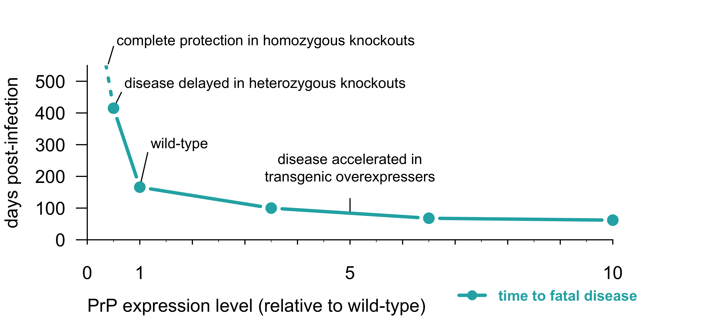
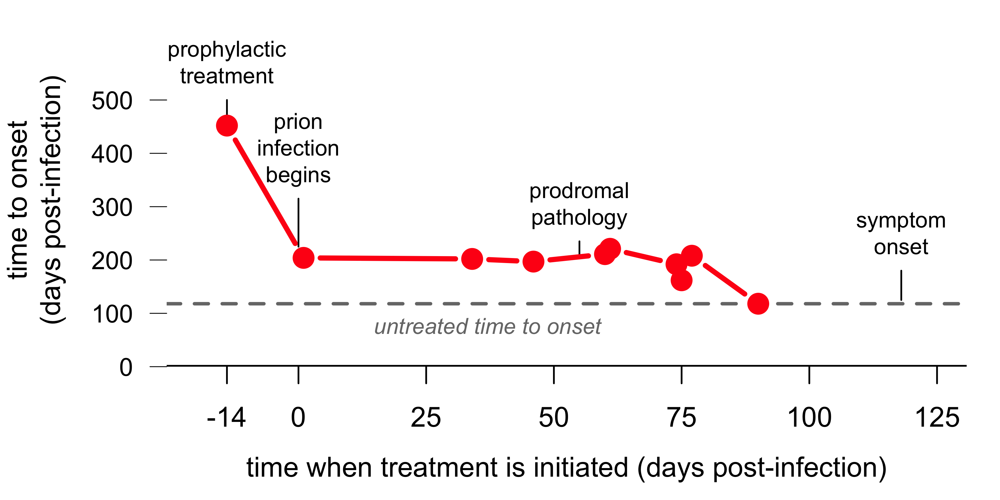
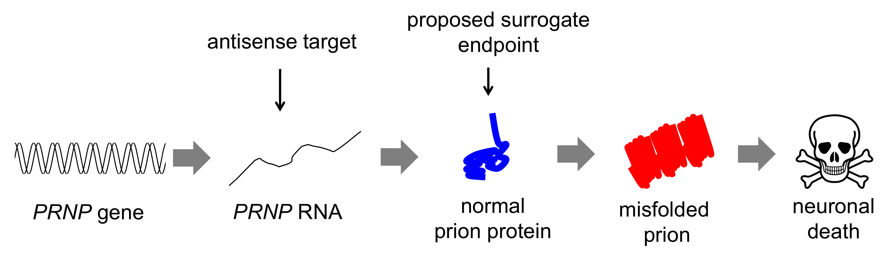

NOTICE: this is the author's version of a work that was accepted for publication in Lancet Neurology. Changes resulting from the publishing process, such as peer review, editing, corrections, structural formatting, and other quality control mechanisms may not be reflected in this document. Changes may have been made to this work since it was submitted for publication. A definitive version was subsequently published in The Lancet Neurology, DOI: [10.1016/S1474-4422(19)30403-X](https://doi.org/10.1016/S1474-4422%2819%2930403-X).

Cite this article as: Vallabh SM, Minikel EV, Schreiber SL, Lander ES. Towards a treatment for genetic prion disease: trials and biomarkers. The Lancet Neurology. 2020;19(4):361–368. DOI: [10.1016/S1474-4422(19)30403-X](https://doi.org/10.1016/S1474-4422%2819%2930403-X).

# Towards a treatment for genetic prion disease: trials and biomarkers

Sonia M. Vallabh1,&dagger;, Eric Vallabh Minikel1, Stuart L. Schreiber1,2, Eric S. Lander1,&dagger;

1. Broad Institute of MIT and Harvard, Cambridge, MA
2. Harvard University, Department of Chemistry and Chemical Biology

&dagger;Correspondence to: svallabh@broadinstitute.org or eric@broadinstitute.org

## Abstract

Prion disease is a rare, fatal, and exceptionally rapid neurodegenerative disease. Though presently incurable, prion disease follows a clear pathogenic mechanism, in which a single gene gives rise to a single protein &mdash; the prion protein, or PrP &mdash; capable of converting into the sole causal disease agent, the misfolded prion. As efforts progress to leverage this mechanistic knowledge toward rational therapies, a principal challenge will be design of meaningful clinical trials. Previous trials in prion disease have been conducted in symptomatic patients, who are often profoundly debilitated at enrollment. Fifteen percent of prion disease cases are genetic, creating an opportunity for early therapeutic intervention to delay or prevent disease. Highly variable age of onset and lack of an established molecular prodrome may render infeasible existing models for testing drugs prior to disease onset. The prion field's ability to advance near-term targeted therapeutics may critically depend on the thoughtful design of rigorous pre-symptomatic trials.

## Introduction

Prion disease is a rare, universally fatal neurodegenerative disease that pivots on the misfolding of the prion protein (PrP) [[Prusiner 1998]]. Most human cases arise spontaneously and are not diagnosed until a state of advanced dementia [[Paterson 2012], [Thompson 2013]]. The severe impairment and rapid decline characteristic of the symptomatic patient population have posed challenges for past clinical trials [[Geschwind 2013], [Haik & Marcon 2014]]. Genetic prion disease, which accounts for roughly 15% of cases [[Minikel 2016]], offers an as yet unrealized opportunity for early therapeutic intervention to delay or prevent disease.

Realizing this opportunity may require creativity in clinical trial design. Pre-symptomatic trials likely cannot aim to demonstrate clinical benefit directly due to disease rarity and variability in age of onset [[Minikel 2019a]]. Secondary prevention strategies based on prodromal pathology will also likely be infeasible owing to the lack of an established prodrome prior to onset of genetic prion disease [[Cortelli 2006], [Cohen 2015], [Rudge 2019]]. But alternative formats may be enabled by the well-established pathophysiology of prion disease. Congruent lines of evidence from biochemistry, human genetics, and mouse models support the centrality of PrP in prion disease [[Prusiner 1998]]. Preclinical proofs of concept suggest that a reduction in PrP levels in the brain would delay disease onset in individuals with pathogenic PrP mutations [[Bueler 1993], [Fischer 1996], [Mallucci 2003], [Safar 2005]]. The ongoing development of antisense oligonucleotides for prion disease [[Raymond 2019]] suggests that the therapeutic goal of PrP reduction may soon become clinically actionable.

Given the well-established and singular role of PrP in disease, quantitative demonstration of reduced PrP levels in the central nervous system via an appropriately qualified pharmacodynamic biomarker is reasonably likely to predict clinical benefit in prion disease. To this end, we present a proposal made to scientists at the U.S. Food and Drug Administration's Center for Drug Evaluation and Research that PrP load in human cerebrospinal fluid (CSF) merits evaluation as a surrogate endpoint in the context of the Accelerated Approval program. Such an approach could enable, for the first time, rigorously controlled trials in pre-symptomatic individuals with the aim of preserving full quality of life.

## The pathogenesis of prion disease

All subtypes of human prion disease, including Creutzfeldt-Jakob disease (CJD), fatal familial insomnia (FFI), and Gerstmann-Straussler-Scheinker disease (GSS), share a common molecular mechanism, the misfolding of the native prion protein (PrP), encoded by the prion protein gene (*PRNP*). The misfolded protein, known as a "prion," is capable of inducing the misfolding of other PrP molecules. Through such templated misfolding, prions spread in a conformational cascade recognized for decades as the molecular mechanism driving PrP's disease-state gain-of-function [[Prusiner 1982], [Prusiner 1998]].

Human prion disease is rare: the true annual incidence is estimated to approach 2 deaths per million population [[Klug 2013]], or &#x7e;1 in 5,000 deaths [[Minikel 2016]]. Although prion disease is infamous for the small minority (<1%) of cases acquired through infection [[Will 2003]], the majority (&#x7e;85%) of cases, termed "sporadic," occur spontaneously, with no known environmental or genetic trigger. The remainder (&#x7e;15%) arise from dominant, gain-of-function, protein-altering variants in *PRNP* [[Minikel 2016]]. Some of these variants are highly penetrant, with lifetime risk approaching 100%, and three such variants account for the majority of genetic cases [[Minikel 2016]]. Age of onset is highly variable and not well-predicted by *PRNP* genotype [[Minikel 2019a]].

Among neurodegenerative diseases, prion disease is notable for its exceptionally rapid clinical course. Symptomatic prion disease patients progress from first symptom to death in a median of 5 months [[Pocchiari 2004]]. While roughly a quarter of genetic cases correspond to mutations that are more slowly progressive on average, the majority of genetic prion disease patients also die less than a year from first symptoms [[Minikel 2019a]]. In this short time they rapidly descend into profound dementia, typically spending the last weeks of life in a state of akinetic mutism. Throughout, the brain is the epicenter of destruction and the only tissue with a known phenotype. Diagnosis is challenging due both to rapidity of decline and the heterogeneity of early symptoms, which can be cognitive, motor, autonomic, or psychiatric in nature [[Rabinovici 2006]]. The average patient does not receive a diagnosis until two-thirds of the way through the short symptomatic course [[Paterson 2012]], at which point they are severely debilitated. Detection of prion seeding activity in CSF using real-time quaking induced conversion (RT-QuIC) now offers excellent sensitivity and specificity [[Orru 2015]], but prion disease is not suspected until an average of 3 months from first symptom [[Appleby 2014]].

Despite its rarity and variability in clinical presentation, prion disease is well understood at the molecular level, with all lines of evidence pointing to the centrality of PrP in prion disease. PrP forms a naturally transmissible proteinaceous pathogen devoid of nucleic acid [[Prusiner 1982]], and biochemical, human genetic, and model organism approaches agree that PrP is absolutely required for prion disease (Table 1).

| category | evidence |
| --- | --- |
| biochemical | <ul><li>Prions, the infectious agent in prion disease, are composed of PrP [[Prusiner 1984]]</li><li>Prion "strains" are encoded in distinct conformations of PrP [[Bessen 1995], [Telling 1996], [Safar 1998]]</li><li>Prion infectivity can be generated *in vitro* from purified PrP [[Legname 2004], [Deleault 2007], [Colby 2009], [Wang 2010]]</li></ul> |
| human genetics | <ul><li>All families with genetic prion disease carry protein-altering variants in *PRNP* [[Mead 2006]]</li><li>Certain missense variants in _PRNP_ confer protection against prion disease [[Palmer 1991], [Shibuya 1998], [Mead 2009]]</li></ul> |
| animal genetics | <ul><li>PrP is required for prion propagation [[Bueler 1993]]</li><li>PrP is required for prion neurotoxicity [[Brandner 1996]]</li><li>PrP dosage and incubation time are inversely correlated [[Fischer 1996]]</li><li>PrP amino acid sequence governs the &quot;species barrier&quot; [[Scott 1989]]</li></ul> |

<b><i>Table 1. Evidence that PrP is central to prion disease pathophysiology.</b></i>

Many mammals are natural hosts of prion disease, and accordingly, the study of prion disease benefits from excellent animal models. In the most commonly used experimental paradigm, intracerebral inoculation of wild-type animals with prions leads to fatal disease after a highly predictable incubation time. Experiments in these models have provided some of the most compelling evidence of PrP's centrality to disease. PrP knockout confers complete resistance to prion disease [[Bueler 1993]], and prion neurotoxicity only affects cells expressing PrP [[Brandner 1996]]. Moreover, PrP gene dosage is correlated with the pace of disease across a wide range of expression levels [[Fischer 1996]], with heterozygous PrP knockout mice surviving prion infection 2.5 times as long as wild-type mice (Figure 1). Similarly, in transgenic mouse models expressing PrP with mutations that cause genetic prion disease in humans, PrP dosage is inversely correlated with age of onset of spontaneous illness [[Watts 2016]].

<i><b>Figure 1. Dependence of prion disease incubation time upon PrP expression level.</b> Above, time to disease in transgenic prion-infected animals is displayed as a function of PrP expression level. Wild-type mice intracerebrally inoculated with prions develop fatal disease in 5-6 months' time. Transgenic mice producing extra PrP develop disease more rapidly, while heterozygous knockout animals producing half the normal amount of PrP remain healthy more than twice as long. Homozygous knockout animals cannot propagate prions and never develop prion disease. Plotted based on data reported by [[Fischer 1996]]</i>

## Previous therapeutic efforts

There exists no disease-modifying treatment for prion disease. Of agents tested clinically, none had strong preclinical evidence supporting advancement to humans, and most have been assessed only in case reports or observational studies in a small number of symptomatic patients [[Stewart 2008]]. Three existing drugs, flupirtine, quinacrine, and doxycycline, have been tested by means of randomized controlled clinical trials in symptomatic prion disease patients, with cognitive or survival endpoints [[Otto 2004], [Geschwind 2013], [Haik & Marcon 2014]]. Prior observational studies reporting a survival increase from quinacrine and doxycycline were overturned by these randomized studies, highlighting the importance of adequately controlled trials. At the same time, these studies illustrate the challenges of conducting trials in a population with advanced, rapidly progressive disease. In the doxycycline trial, for example, nearly as many patients died awaiting randomization as were ultimately enrolled [[Haik & Marcon 2014]].

It is possible that future therapeutic advances could increase vigilance against prion disease, and accelerate diagnosis. But available preclinical data provide additional perspective on the limitations of evaluating therapeutic efficacy only at a symptomatic disease stage. A handful of small molecules and sulfated sugar polymers identified in the past fifteen years have shown convincing antiprion activity in animals. While none have prospects for clinical advancement, owing to either lack of efficacy against human prion strains [[Berry 2013], [Lu & Giles 2013], [Giles 2015], [Giles 2016]] or inadequate brain distribution [[Doh-Ura 2004], [Tsuboi 2009]], these molecules have provided important insights into the time dependence of therapeutic efficacy. In all cases where different preclinical treatment timepoints have been compared, the compound has proven less effective the later it was administered [[Doh-Ura 2004], [Kawasaki 2007], [Wagner 2013], [Giles 2015]]. None have shown efficacy after the onset of symptoms. For example, the most thoroughly studied molecule, IND24, quadrupled survival time when administered before prion infection, increased survival time by about 70% when administered between infection and symptom onset, but lost all efficacy as symptom onset approached (Figure 2).

<i><b>Figure 2. Preclinical studies in prion-infected mice suggest an outsize benefit to early intervention.</b> The efficacy of the antiprion small molecule IND24, which inhibits prion replication by an unknown mechanism of action, depends upon the timepoint at which treatment begins. When given prophylactically, it can quadruple the survival of intracerebrally prion-infected mice. After prion infection begins, it increases survival by only &#x7e;70%. Beginning around 90 days post-infection, still prior to symptom onset, the molecule becomes ineffective. Plotted based on data reported by [[Giles 2015]].</i>

These results may reflect fundamental differences in the molecular stage of disease. Following prion infection of animals, prion titers in the brain rise during a clinically silent incubation phase, with prion accumulation rate corresponding to the animal's PrP expression level. Critically, symptoms emerge only when prion titers have plateaued [[Prusiner 1982], [Sandberg 2014]]. Thus, therapies that inhibit prion replication without impacting prion neurotoxicity may be highly effective prophylactics with no molecular basis for efficacy at symptomatic stages.

These observations suggest that prion drug development has two complementary needs moving forward. In addition to identifying new antiprion molecules worthy of testing in humans, the field would be served by exploration of new clinical paradigms.

## Emerging therapeutic directions

While the above drug discovery efforts were agnostic as to mechanism of action, genetics has long provided a strong therapeutic hypothesis in prion disease: reduction of native PrP. As described above, PrP's centrality to prion disease is well established, and genetic proofs of concept demonstrate a dose-dependent protective effect to lowering PrP. Experimentally, this protective effect has been recapitulated using conditional as well as constitutive knockout systems [[Mallucci 2003], [Safar 2005]]. Substantial evidence also suggests that reducing PrP levels should be well tolerated. PrP knockout mice are viable, fertile, have normal lifespans, and exhibit normal behavior, initially defying efforts to identify a knockout phenotype [[Bueler 1992]]. It has recently been found that, in the peripheral nervous system, PrP undergoes proteolytic cleavage to release a signaling peptide that promotes myelin maintenance [[Kuffer & Lakkaraju 2016]]. PrP knockout mice develop a slowly progressing demyelinating polyneuropathy, which leads to mild sensorimotor deficits late in life [[Bremer 2010]]. Heterozygotes are unaffected [[Bremer 2010]]. No native function has yet been identified in the central nervous system. Knockout cattle [[Richt 2007]] and naturally occurring knockout goats [[Benestad 2012]] are described as phenotypically normal. While late truncating variants in human *PRNP* are known to give rise to a pathogenic secreted protein, early truncating variants appear to convey true loss of function of PrP. Such variants have been observed in a heterozygous state in healthy middle-aged and elderly individuals with no syndromic or neurological health concerns [[Minikel 2016], [Minikel 2019b]]. As such, a reduction in *PRNP* gene dosage appears to be well-tolerated in humans.

## Antisense oligonucleotides

Studies have explored various therapeutic modalities to lower PrP [[White 2008], [Nazor Friberg 2012], [Ahn 2014], [Silber 2014]] but to date no practical means to achieve this therapeutic goal in the human brain has been available. However, on the strength of recent clinical advances in the application of antisense oligonucleotides (ASOs) to other neurological diseases [[Finkel 2017], [Tabrizi 2019]], ASOs designed to target and degrade the PrP RNA have emerged as a plausible near term therapeutic option, and are now in preclinical development [[Raymond 2019]]. ASOs are short (17-20 base) single-stranded oligonucleotides, chemically modified for pharmacokinetic stability, that specifically bind a complementary target RNA. Following binding, ASOs can modulate their targets by a variety of mechanisms; of particular interest for prion disease, they can trigger RNAse H1-mediated degradation of the target RNA, resulting in lower levels of the encoded protein [[Bennett 2016]].

ASOs for neurological applications have been under intensive study, including the recently successfully completed Phase I, II and III trials of nusinersen in children with spinal muscular atrophy [[Chiriboga 2016], [Finkel 2017]] and Phase I/II trial of an anti-Huntingtin ASO (ASO-HTT Rx) in adults with Huntington's Disease (HD) [[Tabrizi 2019]]. While nusinersen acts through splice modification, ASO-HTT Rx acts through degradation of the *HTT* RNA, and has been shown capable of achieving a 40% reduction of mutant huntingtin protein in patient CSF [[Tabrizi 2019]]. Together, these and other programs have compiled a wealth of knowledge regarding the behavior of ASOs in the CNS (Table 2).

| category | observations of ASOs in the CNS |
| --- | --- |
| delivery | <ul><li>ASOs delivered by intrathecal infusion or intrathecal bolus injection have achieved broad distribution across the nonhuman primate CNS. While ASOs are most potent in the cortex, activity is also seen in deep brain structures, with knockdown of target RNA reaching or exceeding 50% in regions including cortex, hippocampus, spinal cord, pons, and cerebellum [[Kordasiewicz 2012], [DeVos 2017], [McCampbell 2018]].</li><li>SMA and HD clinical studies have relied on bolus ASO delivery by intrathecal injection [[Finkel 2017], [Tabrizi 2019]].</li></ul> |
| safety and tolerability | <ul><li>In studies of intrathecally delivered ASOs for SMA, HD, and ALS, treatment was not associated with safety or tolerability concerns, and no serious drug-related adverse events were reported in treated individuals [[Miller 2013], [Chiriboga 2016], [Tabrizi 2019]].</li></ul> |
| time to effect | <ul><li>ASO activity is reflected in target mRNA levels within 14 days of treatment in rodents and non-human primates [[Kordasiewicz 2012], [Rigo 2014], [DeVos 2017]].</li><li>PrP has an estimated _in vivo_ half-life of 18 hours [[Safar 2005]], indicating that ASO-based mRNA depletion could quickly impact PrP at the protein level.</li></ul> |
| dosing regimen | <ul><li>The *in vivo* half-life of nusinersen in CSF was estimated at 132-166 days [[Chiriboga 2016]].</li><li>Clinically, following a series of loading doses, maintenance dosing of nusinersen is every 4 months [[FDA nusinersen printed labeling 2016]].</li><li>The ASO-HTT-Rx Phase I/II study dosed once a month [[Tabrizi 2019]], and the ongoing Phase III study administers drug every two or four months [[NCT03761849]].</li></ul> |

<i><b>Table 2. Behavior of ASOs in the CNS.</b> Extensive preclinical and clinical testing of ASOs has delineated many pharmacological and toxicological parameters relevant to consideration of testing of PrP-lowering ASOs in individuals at risk for prion disease.</i>

Antisense oligonucleotides are uniquely modular drugs. The nucleotide sequences of ASOs specify target binding through Watson-Crick base pairing, yet these sequences are orthogonal to the classes of backbone chemistry that determine many pharmacokinetic and pharmacodynamic parameters [[Bennett 2016]]. In light of this modularity, human data from other CNS ASO programs provide insights into potential properties of a PrP-reducing ASO.

## Trials in pre-symptomatic mutation carriers

The development of a plausible genetically targeted therapeutic for prion disease lends urgency to the question of how clinical trials might be designed to give such a therapeutic its strongest chance to succeed. While at present there is no way to identify sporadic prion disease patients prior to clinical onset, genetic prion disease may offer a unique opportunity for pre-symptomatic intervention. Through predictive genetic testing, individuals carrying high-penetrance *PRNP* mutations can be identified years or decades in advance of symptom onset.

In principle, there are multiple ways to design a trial in pre-symptomatic individuals at risk for a disease. A trial could recruit healthy mutation carriers, randomize them to drug or placebo, and follow them to see if the treatment delays the onset of symptoms. One such trial is being conducted in families with a *PSEN1* mutation causing autosomal dominant early onset Alzheimer's disease, at an estimated cost of estimated at $96 million [[Garber 2012]]. For prion disease, this approach is numerically infeasible because the disease is so rare and the age of onset is so variable [[Minikel 2019a]] &mdash; both more so than for *PSEN1* variants. Further, such a costly trial design would not be tenable in a rare disease with no prospects for off-label or expanded use of the drug once approved.

## Prodromal biomarkers

In more slowly progressive neurodegenerative diseases, it is now well established that prodromal imaging or biochemical tests can detect pathological changes well before symptoms manifest [[Bateman 2012], [Byrne 2017]]. Such prodromal biomarkers may offer opportunities for secondary prevention, enabling selective enrollment of individuals close to onset [[Sperling 2014]], or allowing subclinical markers of disease to be tracked as outcome measures. At present, however, no such markers exist in prion disease. Prospective studies of genetic prion disease mutation carriers have reported consistent neurological and neurophysiological signatures &mdash; including brain volumetric changes by MRI [[Cohen 2015]], regional hypometabolism by FDG-PET [[Cortelli 2006]], and lower limb sensory defects [[Rudge 2019]] &mdash; concurrently with or shortly after symptomatic onset, but not prior to onset. At most, suggestive changes were noted in single individuals approximately one year prior to symptom onset [[Cortelli 2006], [Cohen 2015]]. In an ongoing natural history study of pre-symptomatic mutation carriers and controls, we have measured two markers of neuronal damage, neurofilament light (NfL) and total tau (T-tau), as well as prion &quot;seeding activity&quot; [[Orru 2015]] in CSF, all markers that are highly diagnostic and/or prognostic in symptomatic prion disease patients [[Orru 2015], [Steinacker 2016], [Abu Rumeileh 2017], [Franceschini 2017], [Foutz 2017], [Kovacs 2017], [Thompson 2018], [Staffaroni 2019]]. NfL and T-tau were within the normal range in all pre-symptomatic carriers, indistinguishable from non-carrier controls; seeding activity was observed in only 1 of 23 pre-symptomatic individuals, and any prognostic implication remains unclear [[Vallabh 2019b]].

This picture could change with further study, particularly in the &#x7e;25% of genetic prion disease patients whose mutations can predispose to more slowly progressive disease. If prodromal changes can be identified in this population, change in such markers might provide important supporting data for a drug development program. Still, validating the prognostic value of such markers by observing several onsets could take decades [[Cortelli 2006], [Cohen 2015], [Rudge 2019], [Minikel 2019a]]. More importantly, a focus on individuals with prodromal pathology would prohibitively limit available trial participants, and preclinical proofs of concept discussed above suggest that this approach might specifically enrich for those individuals likely to benefit the least from a drug, as prion amplification and neuropathology would have already begun.

## Surrogate endpoints

There exists another option for clinical research in pre-symptomatic mutation carriers: trials designed to support Accelerated Approval. Under this U.S. Food and Drug Administration (FDA) program, trials can employ a surrogate endpoint that is reasonably likely to predict clinical benefit. Developed in the 1992 to address the AIDS crisis, Accelerated Approval served as a mechanism by which AIDS drugs could secure provisional approval on the basis of decreasing HIV viral load in patients. This allowed new drugs to reach patients swiftly, without having to follow randomized patients to death. The link between viral load and clinical outcome was considered biologically well-established, and clinical benefit was subsequently confirmed post-approval. Since then, Congress has incorporated Accelerated Approval into law and has clarified that this mechanism is appropriate to consider where disease biology provides comparably predictive surrogate endpoints, and where rareness and severity render other trial designs infeasible [[21 USC 356]].

PrP lies directly on the sole pathway of prion disease pathophysiology (Figure 3). All available lines of evidence agree that PrP is the pivotal molecule on this pathway, required for pathogen formation, disease initiation and disease progression in a dose-dependent manner. A demonstration of target engagement for a PrP-lowering drug &mdash; a pharmacodynamic biomarker reflecting a lowered brain PrP concentration &mdash; would therefore be reasonably likely to predict clinical benefit in prion disease. The conceptual resemblance between prion disease and infectious disease highlights the opportunity for PrP concentration to serve as a meaningful indicator with some analogy to &quot;viral load&quot; in HIV.

<i><b>Figure 3. Drug target and proposed surrogate endpoint within the pathophysiological pathway of prion disease.</b> In this proposal, drug candidates such as antisense oligonucleotides designed against the human PRNP gene sequence can be administered in clinical trials to healthy people at risk for genetic prion disease, before the disease process ever begins. The drug is expected to engage its target, the PRNP RNA, in the brain, reducing levels of this RNA and thus of PrP protein as well. The anticipated drug-dependent change in PrP levels in the brain can be measured in CSF as a proxy sampling compartment. Because PrP lies directly on the sole pathway of disease and is essential for disease development and progression, lowering of CSF PrP is expected to be reasonably likely to predict clinical benefit. Thus, a demonstration of lowered CSF PrP in pre-symptomatic individuals at risk for genetic prion disease could potentially support an application for Accelerated Approval of a PrP-lowering drug. Adapted from [[Raymond 2019]]</i>

PrP is abundant in human CSF, with concentrations on the order of tens to hundreds of nanograms per milliliter detected using commercially available ELISA kits [[Abu Rumeileh 2017], [Villar-Pique & Schmitz 2018]]. PrP is much less abundant in blood than in CSF, suggesting that the detected PrP is primarily CNS- rather than blood-derived, and therefore reflects the tissue of interest [[Vallabh 2019a]]. CSF PrP levels are reduced in individuals with symptomatic prion disease compared to controls or patients with other dementias [[Dorey 2015], [Abu Rumeileh 2017], [Villar-Pique & Schmitz 2018], [Vallabh 2019a], [Minikel & Kuhn 2019]], perhaps due to incorporation in plaques or intracellular accumulation. Critically, however, this decline does not appear to be underway in pre-symptomatic individuals: an ongoing natural history study has confirmed the test-retest stability (mean coefficient of variation 7%) of CSF PrP in pre-symptomatic mutation carriers over the short (2-4 month) and medium (10-20 month) term [[Vallabh 2019b]]. CSF PrP levels were stable even in one pre-symptomatic individual with prion seeding activity in CSF. Thus, the pharmacodynamic effects of a PrP-lowering drug should be measurable in the CSF of pre-symptomatic individuals without confounding from disease state.

Additional considerations must be worked out as PrP-lowering ASOs advance. As in other CNS ASO programs [[Tabrizi 2019]], detailed pharmacodynamic modeling in non-human primate brain will critically inform how reduction of CSF PrP levels reflects knockdown across the brain. Corresponding studies in prion-infected rodents could illuminate how brain regional PrP knockdown translates into delay in disease endpoints. As in other Accelerated Approval programs, following biomarker-based provisional approval, clinical benefit would need to be confirmed in a post-marketing study. Under reasonable assumptions, a registry-based study of treated pre-symptomatic individuals, compared to historical controls, could provide an estimate of delay in disease onset within five to fifteen years [[Minikel 2019a]].

## Regulatory and community engagement

As we considered an Accelerated Approval strategy, we took advantage of the FDA's Critical Path Innovation Meeting (CPIM) mechanism to request an in-person meeting with FDA scientists regarding the prospects for Accelerated Approval of a genetic prion disease drug based on a demonstration of CSF PrP in asymptomatic mutation carriers, based on the considerations above. In November 2017 at FDA's headquarters in Silver Spring, Maryland, we had the opportunity to discuss the points outlined above with 25 of the agency's scientists. The FDA scientists were supportive of the concept, offered constructive questions and ideas about appropriate biomarker and preclinical data that would be needed, and generously offered to provide continued input. While the FDA does not make commitments under the CPIM mechanism, we felt the process was a model for regulatory partnership in rare-disease drug development, and we are continuing to work closely with FDA as we gather further data in support of this biomarker and clinical strategy. Proactive consultation with non-US regulatory bodies and with payers are also important near-term priorities. Finally, engaging the pre-symptomatic patient community and building trial-ready cohorts will be critical to enabling prevention in this population (Panel 1).

| Building our team |
| ---- |
| The best-laid therapeutic and clinical strategies still have no hope of advancing without a third essential element: patients. One U.K. study found that three-quarters of individuals at risk for genetic prion disease opt against predictive genetic testing [[Owen 2014]]. Many people are counseled against testing on the basis that the result is not actionable. However, some patients may wish to know their status, and motivated at-risk individuals may play an active and essential role in bringing a therapeutic into existence. Natural history and biomarker studies help to set the stage for trials, powered by donated samples and data. Registries demonstrating an organized patient base inspire drug development partnerships. Trials depend on participants. While no one choice will best serve everyone at risk, it is important to acknowledge the full spectrum of preference present in every genetic disease community, and to be prepared to support, equip and empower those who wish pursue their genetic information.  **Offering forward-looking counseling.** Genetic counselors and physicians who counsel families at genetic risk have a profound opportunity to set the tone for how these individuals will relate to their risk for the rest of their lives. As neurodegenerative diseases become meaningfully treatable for the first time, it is more important than ever to offer genetic counseling that encompasses the pros as well as cons of predictive testing. Especially in a rapidly progressive disease such as prion disease, being able to make an informed decision in advance of symptoms may be essential to accessing and benefitting from plausible near-term therapeutics.  **Referring healthy mutation carriers to prionregistry.org.** In July 2017, in collaboration with the patient organizations CJD Foundation and the CJD International Support Alliance, we launched a simple online portal called the Prion Registry ([prionregistry.org](https://prionregistry.org/)). The registry aims to be a location-agnostic, researcher-agnostic resource that provides information about research studies and trials to patients, carriers and families on an opt-in basis, while also providing de-identified summary statistics to the research community. Referring at-risk individuals to this centralized platform will help to motivate drug development partners across sectors, and to facilitate swift trial recruitment when the time comes. |

<i><b>Panel 1. Building our team.</i></b>

## Conclusions and next steps

Today, there exists no disease-modifying therapeutic for any adult-onset neurodegenerative disease. Calls are mounting for therapeutic efforts to aim earlier in the disease process [[McDade & Bateman 2017], [FDA Guidance 2018]], but the tractability of doing so varies across indications based on disease biology and available tools. Genetic prion disease has unique assets: a single causal gene and protein, robust genetic proofs of concept supporting a knockdown therapeutic strategy, and faithful animal models in which this strategy can be honed. These insights and resources align to present a unique opportunity to shift therapeutic intervention upstream, beyond early symptoms or preclinical pathology, to genetically informed primary prevention. The unusual constraints of genetic prion disease make it an ideal test case for a concept with resonance well beyond this one rare indication: the leveraging of predictive genetics to rewrite the future, and keep healthy people healthy.

--

## Search strategy and selection criteria

Studies were identified through reviews and Google Scholar and PubMed searches in English for prion, PrP, Creutzfeldt-Jakob disease, fatal familial insomnia, and Gerstmann-Straussler-Scheinker disease from 2014-2019, and were included based on their relevance to strategies and considerations for prevention of genetic prion disease.

## Glossary of terms

*Accelerated approval*

A US FDA program through which drugs for serious conditions, that fill an unmet medical need, may be granted provisional approval based on a surrogate, rather than clinical, endpoint.

*Antisense oligonucleotides (ASOs)*

Short synthetic oligonucleotide capable of binding complementary RNA molecules in the body, and modulating their levels through multiple mechanisms.

*Clinical endpoint*

A primary outcome in a clinical trial that directly reports on how an individual feels or functions.

*Creutzfeldt-Jakob disease (CJD)*

The most common clinical term assigned to human prion disease. Sporadic human prion disease often receives the clinical designation of sporadic CJD. In addition, genetic prion disease associated with a subset of pathogenic *PRNP* variants may be referred to as genetic CJD.

*Central nervous system (CNS)*

The major part of the nervous system in humans and other animals, encompassing the brain and spinal cord.

*Cerebrospinal fluid (CSF)*

The clear, colorless fluid that surrounds the brain and spinal cord.

*Critical Path Innovation Meeting (CPIM)*

A non-binding mechanism by which stakeholders across sectors can proactively engage with FDA scientists with the goal of improving efficiency and success of drug development.

*United States Food and Drug Administration (FDA)*

A federal agency of the United States Department of Health and Human Services tasked with protecting and promoting human health, including through supervision of pharmaceutical drugs.

*Fatal familial insomnia (FFI)*

A form of genetic prion disease associated with the D178N-129M *PRNP* genotype.

*Genetic prion disease*

Prion disease caused by autosomal dominant variants in the prion protein gene, *PRNP*. Genetic cases account for roughly 15% of prion disease cases.

*Gerstmann-Straussler-Scheinker disease (GSS)*

A form of genetic prion disease associated with a subset of pathogenic variants in _PRNP_.

*Pharmacodynamic biomarker*

A biomarker used to show, in an individual who has been exposed to an intervention, that a biological response has occurred.

*Prion protein (PrP)*

The native, normally folded prion protein, encoded by the gene *PRNP* in humans. PrP is expressed by all humans as part of normal physiology. Normal PrP is sometimes denoted PrPC to indicate that it is the &quot;celluar&quot; conformer present in normal biology.

*Prion*

The term given to the proteinaceous pathogen that causes prion disease. Prions are formed from host-encoded, conformationally corrupted PrP molecules. The term PrPSc (referencing scrapie, a prion disease of sheep and goats) is sometimes used to denote prions.

*Prion disease*

A rapidly progressive neurodegenerative disease. This term encompasses multiple clinical subtypes including CJD, FFI and GSS. Prion disease has multiple etiologies &mdash; sporadic, genetic and acquired &mdash; but all are caused by prions, which are composed of the prion protein (PrP).

*PRNP*

The prion protein gene, located on chromosome 20 in humans. This gene encodes the prion protein, or PrP. The mouse ortholog is denoted *Prnp*.

*Prodrome*

A detectable phase of a disease process that precedes symptom onset.

*Sporadic prion disease*

Prion disease that occurs spontaneously, with no known genetic or environmental trigger. Roughly 85% of cases of prion disease are sporadic.

*Surrogate endpoint*

A clinical trial endpoint used as a substitute for a direct measure of clinical benefit. Surrogate endpoints must either be shown to correlate with clinical benefit, or considered reasonably likely to correlate with clinical benefit.

## Acknowledgments

Sonia Vallabh, the lead author of this article, re-trained as a biomedical researcher in order to develop a drug to delay or prevent her own onset of genetic prion disease. She learned in 2011 that she had inherited a lethal, highly penetrant _PRNP_ mutation (D178N) from her mother, who had died of a then-undiagnosed rapidly progressive dementia in 2010. Sonia and her husband, Eric Minikel, quit their previous careers in law and engineering in order to devote their lives to preventing Sonia's disease. They earned their PhDs in Biological and Biomedical Sciences at Harvard University in 2019 and now lead a prion research group at the Broad Institute of MIT and Harvard. Their research on prion disease encompasses preclinical therapeutic proof-of-concept studies, biomarker development, genetics, natural history, and engagement with the patient community and with regulators.

## Author contributions

SV and EVM conceived and wrote the article with mentorship and guidance from SLS and ESL.

[Abu Rumeileh 2017]: https://www.ncbi.nlm.nih.gov/pmc/articles/PMC5181677/ "Abu Rumeileh S, Lattanzio F, Stanzani Maserati M, Rizzi R, Capellari S, Parchi P. Diagnostic Accuracy of a Combined Analysis of Cerebrospinal Fluid t-PrP, t-tau, p-tau, and Aβ42 in the Differential Diagnosis of Creutzfeldt-Jakob Disease from Alzheimer’s Disease with Emphasis on Atypical Disease Variants. J Alzheimers Dis. 55(4):1471–1480. PMCID: PMC5181677"
[Ahn 2014]: https://www.ncbi.nlm.nih.gov/pmc/articles/PMC4035323/ "Ahn M, Bajsarowicz K, Oehler A, Lemus A, Bankiewicz K, DeArmond SJ. Convection-Enhanced Delivery of AAV2-PrPshRNA in Prion-Infected Mice. PLoS ONE [Internet]. 2014 May 27 [cited 2019 Feb 19];9(5). Available from: https://www.ncbi.nlm.nih.gov/pmc/articles/PMC4035323/ PMCID: PMC4035323"
[Appleby 2014]: https://www.ncbi.nlm.nih.gov/pubmed/24934543/ "Appleby BS, Rincon-Beardsley TD, Appleby KK, Crain BJ, Wallin MT. Initial diagnoses of patients ultimately diagnosed with prion disease. J Alzheimers Dis JAD. 2014;42(3):833–839. PMID: 24934543"
[Bateman 2012]: https://www.ncbi.nlm.nih.gov/pmc/articles/PMC3474597/ "Bateman RJ, Xiong C, Benzinger TLS, Fagan AM, Goate A, Fox NC, Marcus DS, Cairns NJ, Xie X, Blazey TM, Holtzman DM, Santacruz A, Buckles V, Oliver A, Moulder K, Aisen PS, Ghetti B, Klunk WE, McDade E, Martins RN, Masters CL, Mayeux R, Ringman JM, Rossor MN, Schofield PR, Sperling RA, Salloway S, Morris JC, Dominantly Inherited Alzheimer Network. Clinical and biomarker changes in dominantly inherited Alzheimer’s disease. N Engl J Med. 2012 Aug 30;367(9):795–804. PMCID: PMC3474597"
[Benestad 2012]: https://www.ncbi.nlm.nih.gov/pmc/articles/PMC3542104/ "Benestad SL, Austbø L, Tranulis MA, Espenes A, Olsaker I. Healthy goats naturally devoid of prion protein. Vet Res. 2012;43:87. PMCID: PMC3542104"
[Bennett 2016]: https://www.ncbi.nlm.nih.gov/pubmed/27732800/ "Bennett CF, Baker BF, Pham N, Swayze E, Geary RS. Pharmacology of Antisense Drugs. Annu Rev Pharmacol Toxicol. 2016 Oct 10; PMID: 27732800"
[Berry 2013]: https://www.ncbi.nlm.nih.gov/pmc/articles/PMC3816483/ "Berry DB, Lu D, Geva M, Watts JC, Bhardwaj S, Oehler A, Renslo AR, DeArmond SJ, Prusiner SB, Giles K. Drug resistance confounding prion therapeutics. Proc Natl Acad Sci U S A. 2013 Oct 29;110(44):E4160-4169. PMCID: PMC3816483"
[Bessen 1995]: https://www.ncbi.nlm.nih.gov/pubmed/7791905/ "Bessen RA, Kocisko DA, Raymond GJ, Nandan S, Lansbury PT, Caughey B. Non-genetic propagation of strain-specific properties of scrapie prion protein. Nature. 1995 Jun 22;375(6533):698–700. PMID: 7791905"
[Brandner 1996]: https://www.ncbi.nlm.nih.gov/pubmed/8552188/ "Brandner S, Isenmann S, Raeber A, Fischer M, Sailer A, Kobayashi Y, Marino S, Weissmann C, Aguzzi A. Normal host prion protein necessary for scrapie-induced neurotoxicity. Nature. 1996 Jan 25;379(6563):339–343. PMID: 8552188"
[Bremer 2010]: https://www.ncbi.nlm.nih.gov/pubmed/20098419/ "Bremer J, Baumann F, Tiberi C, Wessig C, Fischer H, Schwarz P, Steele AD, Toyka KV, Nave K-A, Weis J, Aguzzi A. Axonal prion protein is required for peripheral myelin maintenance. Nat Neurosci. 2010 Mar;13(3):310–318. PMID: 20098419"
[Byrne 2017]: https://www.ncbi.nlm.nih.gov/pmc/articles/PMC5507767/ "Byrne LM, Rodrigues FB, Blennow K, Durr A, Leavitt BR, Roos RAC, Scahill RI, Tabrizi SJ, Zetterberg H, Langbehn D, Wild EJ. Neurofilament light protein in blood as a potential biomarker of neurodegeneration in Huntington’s disease: a retrospective cohort analysis. Lancet Neurol. 2017 Aug;16(8):601–609. PMCID: PMC5507767"
[Bueler 1992]: https://www.ncbi.nlm.nih.gov/pubmed/1373228/ "Büeler H, Fischer M, Lang Y, Bluethmann H, Lipp HP, DeArmond SJ, Prusiner SB, Aguet M, Weissmann C. Normal development and behaviour of mice lacking the neuronal cell-surface PrP protein. Nature. 1992 Apr 16;356(6370):577–582. PMID: 1373228"
[Bueler 1993]: https://www.ncbi.nlm.nih.gov/pubmed/8100741/ "Büeler H, Aguzzi A, Sailer A, Greiner RA, Autenried P, Aguet M, Weissmann C. Mice devoid of PrP are resistant to scrapie. Cell. 1993 Jul 2;73(7):1339–1347. PMID: 8100741"
[Chiriboga 2016]: https://www.ncbi.nlm.nih.gov/pmc/articles/PMC4782111/ "Chiriboga CA, Swoboda KJ, Darras BT, Iannaccone ST, Montes J, De Vivo DC, Norris DA, Bennett CF, Bishop KM. Results from a phase 1 study of nusinersen (ISIS-SMN(Rx)) in children with spinal muscular atrophy. Neurology. 2016 Mar 8;86(10):890–897. PMCID: PMC4782111"
[Cohen 2015]: https://www.ncbi.nlm.nih.gov/pubmed/25522698/ "Cohen OS, Chapman J, Korczyn AD, Nitsan Z, Appel S, Hoffmann C, Rosenmann H, Kahana E, Lee H. Familial Creutzfeldt-Jakob disease with the E200K mutation: longitudinal neuroimaging from asymptomatic to symptomatic CJD. J Neurol. 2015 Mar;262(3):604–613. PMID: 25522698"
[Colby 2009]: https://www.ncbi.nlm.nih.gov/pmc/articles/PMC2787151/ "Colby DW, Giles K, Legname G, Wille H, Baskakov IV, DeArmond SJ, Prusiner SB. Design and construction of diverse mammalian prion strains. Proc Natl Acad Sci U S A. 2009 Dec 1;106(48):20417–20422. PMCID: PMC2787151"
[Cortelli 2006]: https://www.ncbi.nlm.nih.gov/pubmed/16399807/ "Cortelli P, Perani D, Montagna P, Gallassi R, Tinuper P, Provini F, Federica P, Avoni P, Ferrillo F, Anchisi D, Moresco RM, Fazio F, Parchi P, Baruzzi A, Lugaresi E, Gambetti P. Pre-symptomatic diagnosis in fatal familial insomnia: serial neurophysiological and 18FDG-PET studies. Brain J Neurol. 2006 Mar;129(Pt 3):668–675. PMID: 16399807"
[DeVos 2017]: https://www.ncbi.nlm.nih.gov/pubmed/28123067/ "DeVos SL, Miller RL, Schoch KM, Holmes BB, Kebodeaux CS, Wegener AJ, Chen G, Shen T, Tran H, Nichols B, Zanardi TA, Kordasiewicz HB, Swayze EE, Bennett CF, Diamond MI, Miller TM. Tau reduction prevents neuronal loss and reverses pathological tau deposition and seeding in mice with tauopathy. Sci Transl Med. 2017 Jan 25;9(374). PMID: 28123067"
[Deleault 2007]: https://www.ncbi.nlm.nih.gov/pmc/articles/PMC1887554/ "Deleault NR, Harris BT, Rees JR, Supattapone S. Formation of native prions from minimal components in vitro. Proc Natl Acad Sci U S A. 2007 Jun 5;104(23):9741–9746. PMCID: PMC1887554"
[Doh-Ura 2004]: https://www.ncbi.nlm.nih.gov/pmc/articles/PMC400350/ "Doh-ura K, Ishikawa K, Murakami-Kubo I, Sasaki K, Mohri S, Race R, Iwaki T. Treatment of transmissible spongiform encephalopathy by intraventricular drug infusion in animal models. J Virol. 2004 May;78(10):4999–5006. PMCID: PMC400350"
[Dorey 2015]: https://www.ncbi.nlm.nih.gov/pubmed/25559883/ "Dorey A, Tholance Y, Vighetto A, Perret-Liaudet A, Lachman I, Krolak-Salmon P, Wagner U, Struyfs H, De Deyn PP, El-Moualij B, Zorzi W, Meyronet D, Streichenberger N, Engelborghs S, Kovacs GG, Quadrio I. Association of cerebrospinal fluid prion protein levels and the distinction between Alzheimer disease and Creutzfeldt-Jakob disease. JAMA Neurol. 2015 Mar;72(3):267–275. PMID: 25559883"
[Finkel 2017]: https://www.ncbi.nlm.nih.gov/pubmed/29091570/ "Finkel RS, Mercuri E, Darras BT, Connolly AM, Kuntz NL, Kirschner J, Chiriboga CA, Saito K, Servais L, Tizzano E, Topaloglu H, Tulinius M, Montes J, Glanzman AM, Bishop K, Zhong ZJ, Gheuens S, Bennett CF, Schneider E, Farwell W, De Vivo DC, ENDEAR Study Group. Nusinersen versus Sham Control in Infantile-Onset Spinal Muscular Atrophy. N Engl J Med. 2017 02;377(18):1723–1732. PMID: 29091570"
[Fischer 1996]: https://www.ncbi.nlm.nih.gov/pmc/articles/PMC450028/ "Fischer M, Rülicke T, Raeber A, Sailer A, Moser M, Oesch B, Brandner S, Aguzzi A, Weissmann C. Prion protein (PrP) with amino-proximal deletions restoring susceptibility of PrP knockout mice to scrapie. EMBO J. 1996 Mar 15;15(6):1255–1264. PMCID: PMC450028"
[Foutz 2017]: https://www.ncbi.nlm.nih.gov/pmc/articles/PMC5266667/ "Foutz A, Appleby BS, Hamlin C, Liu X, Yang S, Cohen Y, Chen W, Blevins J, Fausett C, Wang H, Gambetti P, Zhang S, Hughson A, Tatsuoka C, Schonberger LB, Cohen ML, Caughey B, Safar JG. Diagnostic and prognostic value of human prion detection in cerebrospinal fluid. Ann Neurol. 2017 Jan;81(1):79–92. PMCID: PMC5266667"
[Franceschini 2017]: https://www.ncbi.nlm.nih.gov/pmc/articles/PMC5587608/ "Franceschini A, Baiardi S, Hughson AG, McKenzie N, Moda F, Rossi M, Capellari S, Green A, Giaccone G, Caughey B, Parchi P. High diagnostic value of second generation CSF RT-QuIC across the wide spectrum of CJD prions. Sci Rep. 2017 Sep 6;7(1):10655. PMCID: PMC5587608"
[Garber 2012]: https://www.ncbi.nlm.nih.gov/pubmed/22871696/ "Garber K. Genentech’s Alzheimer’s antibody trial to study disease prevention. Nat Biotechnol. 2012 Aug;30(8):731–732. PMID: 22871696"
[Geschwind 2013]: https://www.ncbi.nlm.nih.gov/pmc/articles/PMC4211922/ "Geschwind MD, Kuo AL, Wong KS, Haman A, Devereux G, Raudabaugh BJ, Johnson DY, Torres-Chae CC, Finley R, Garcia P, Thai JN, Cheng HQ, Neuhaus JM, Forner SA, Duncan JL, Possin KL, Dearmond SJ, Prusiner SB, Miller BL. Quinacrine treatment trial for sporadic Creutzfeldt-Jakob disease. Neurology. 2013 Dec 3;81(23):2015–2023. PMCID: PMC4211922"
[Giles 2015]: https://www.ncbi.nlm.nih.gov/pubmed/26224882/ "Giles K, Berry DB, Condello C, Hawley RC, Gallardo-Godoy A, Bryant C, Oehler A, Elepano M, Bhardwaj S, Patel S, Silber BM, Guan S, DeArmond SJ, Renslo AR, Prusiner SB. Different 2-Aminothiazole Therapeutics Produce Distinct Patterns of Scrapie Prion Neuropathology in Mouse Brains. J Pharmacol Exp Ther. 2015 Oct;355(1):2–12. PMID: 26224882"
[Giles 2016]: https://www.ncbi.nlm.nih.gov/pmc/articles/PMC4998675/ "Giles K, Berry DB, Condello C, Dugger BN, Li Z, Oehler A, Bhardwaj S, Elepano M, Guan S, Silber BM, Olson SH, Prusiner SB. Optimization of Aryl Amides that Extend Survival in Prion-Infected Mice. J Pharmacol Exp Ther. 2016 Sep;358(3):537–547. PMCID: PMC4998675"
[Haik & Marcon 2014]: https://www.ncbi.nlm.nih.gov/pubmed/24411709/ "Haïk S, Marcon G, Mallet A, Tettamanti M, Welaratne A, Giaccone G, Azimi S, Pietrini V, Fabreguettes J-R, Imperiale D, Cesaro P, Buffa C, Aucan C, Lucca U, Peckeu L, Suardi S, Tranchant C, Zerr I, Houillier C, Redaelli V, Vespignani H, Campanella A, Sellal F, Krasnianski A, Seilhean D, Heinemann U, Sedel F, Canovi M, Gobbi M, Di Fede G, Laplanche J-L, Pocchiari M, Salmona M, Forloni G, Brandel J-P, Tagliavini F. Doxycycline in Creutzfeldt-Jakob disease: a phase 2, randomised, double-blind, placebo-controlled trial. Lancet Neurol. 2014 Feb;13(2):150–158. PMID: 24411709"
[Kawasaki 2007]: https://www.ncbi.nlm.nih.gov/pmc/articles/PMC2169081/ "Kawasaki Y, Kawagoe K, Chen C, Teruya K, Sakasegawa Y, Doh-ura K. Orally administered amyloidophilic compound is effective in prolonging the incubation periods of animals cerebrally infected with prion diseases in a prion strain-dependent manner. J Virol. 2007 Dec;81(23):12889–12898. PMCID: PMC2169081"
[Klug 2013]: https://www.ncbi.nlm.nih.gov/pubmed/23965290/ "Klug GMJA, Wand H, Simpson M, Boyd A, Law M, Masters CL, Matěj R, Howley R, Farrell M, Breithaupt M, Zerr I, van Duijn C, Ibrahim-Verbaas C, Mackenzie J, Will RG, Brandel J-P, Alperovitch A, Budka H, Kovacs GG, Jansen GH, Coulthard M, Collins SJ. Intensity of human prion disease surveillance predicts observed disease incidence. J Neurol Neurosurg Psychiatry. 2013 Dec;84(12):1372–1377. PMID: 23965290"
[Kordasiewicz 2012]: https://www.ncbi.nlm.nih.gov/pmc/articles/PMC3383626/ "Kordasiewicz HB, Stanek LM, Wancewicz EV, Mazur C, McAlonis MM, Pytel KA, Artates JW, Weiss A, Cheng SH, Shihabuddin LS, Hung G, Bennett CF, Cleveland DW. Sustained therapeutic reversal of Huntington’s disease by transient repression of huntingtin synthesis. Neuron. 2012 Jun 21;74(6):1031–1044. PMCID: PMC3383626"
[Kovacs 2017]: https://www.ncbi.nlm.nih.gov/pubmed/28816001/ "Kovacs GG, Andreasson U, Liman V, Regelsberger G, Lutz MI, Danics K, Keller E, Zetterberg H, Blennow K. Plasma and cerebrospinal fluid tau and neurofilament concentrations in rapidly progressive neurological syndromes: a neuropathology-based cohort. Eur J Neurol. 2017 Nov;24(11):1326-e77. PMID: 28816001"
[Kuffer & Lakkaraju 2016]: https://www.ncbi.nlm.nih.gov/pubmed/27501152/ "Küffer A, Lakkaraju AKK, Mogha A, Petersen SC, Airich K, Doucerain C, Marpakwar R, Bakirci P, Senatore A, Monnard A, Schiavi C, Nuvolone M, Grosshans B, Hornemann S, Bassilana F, Monk KR, Aguzzi A. The prion protein is an agonistic ligand of the G protein-coupled receptor Adgrg6. Nature. 2016 Aug 25;536(7617):464–468. PMID: 27501152"
[Legname 2004]: https://www.ncbi.nlm.nih.gov/pubmed/15286374/ "Legname G, Baskakov IV, Nguyen H-OB, Riesner D, Cohen FE, DeArmond SJ, Prusiner SB. Synthetic mammalian prions. Science. 2004 Jul 30;305(5684):673–676. PMID: 15286374"
[Lu & Giles 2013]: https://www.ncbi.nlm.nih.gov/pmc/articles/PMC3807058/ "Lu D, Giles K, Li Z, Rao S, Dolghih E, Gever JR, Geva M, Elepano ML, Oehler A, Bryant C, Renslo AR, Jacobson MP, Dearmond SJ, Silber BM, Prusiner SB. Biaryl amides and hydrazones as therapeutics for prion disease in transgenic mice. J Pharmacol Exp Ther. 2013 Nov;347(2):325–338. PMCID: PMC3807058"
[Mallucci 2003]: https://www.ncbi.nlm.nih.gov/pubmed/14593181/ "Mallucci G, Dickinson A, Linehan J, Klöhn P-C, Brandner S, Collinge J. Depleting neuronal PrP in prion infection prevents disease and reverses spongiosis. Science. 2003 Oct 31;302(5646):871–874. PMID: 14593181"
[McCampbell 2018]: https://www.ncbi.nlm.nih.gov/pmc/articles/PMC6063493/ "McCampbell A, Cole T, Wegener AJ, Tomassy GS, Setnicka A, Farley BJ, Schoch KM, Hoye ML, Shabsovich M, Sun L, Luo Y, Zhang M, Comfort N, Wang B, Amacker J, Thankamony S, Salzman DW, Cudkowicz M, Graham DL, Bennett CF, Kordasiewicz HB, Swayze EE, Miller TM. Antisense oligonucleotides extend survival and reverse decrement in muscle response in ALS models. J Clin Invest. 128(8):3558–3567. PMCID: PMC6063493"
[McDade & Bateman 2017]: https://www.ncbi.nlm.nih.gov/pubmed/28703214/ "McDade E, Bateman RJ. Stop Alzheimer’s before it starts. Nat News. 2017 Jul 13;547(7662):153."
[Mead 2009]: https://www.ncbi.nlm.nih.gov/pubmed/19923577/ "Mead S, Whitfield J, Poulter M, Shah P, Uphill J, Campbell T, Al-Dujaily H, Hummerich H, Beck J, Mein CA, Verzilli C, Whittaker J, Alpers MP, Collinge J. A novel protective prion protein variant that colocalizes with kuru exposure. N Engl J Med. 2009 Nov 19;361(21):2056–2065. PMID: 19923577"
[Mead 2006]: https://www.ncbi.nlm.nih.gov/pubmed/16391566/ "Mead S. Prion disease genetics. Eur J Hum Genet EJHG. 2006 Mar;14(3):273–281. PMID: 16391566"
[Miller 2013]: https://www.ncbi.nlm.nih.gov/pmc/articles/PMC3712285/ "Miller TM, Pestronk A, David W, Rothstein J, Simpson E, Appel SH, Andres PL, Mahoney K, Allred P, Alexander K, Ostrow LW, Schoenfeld D, Macklin EA, Norris DA, Manousakis G, Crisp M, Smith R, Bennett CF, Bishop KM, Cudkowicz ME. An antisense oligonucleotide against SOD1 delivered intrathecally for patients with SOD1 familial amyotrophic lateral sclerosis: a phase 1, randomised, first-in-man study. Lancet Neurol. 2013 May;12(5):435–442. PMCID: PMC3712285"
[Minikel 2016]: https://www.ncbi.nlm.nih.gov/pubmed/26791950/ "Minikel EV, Vallabh SM, Lek M, Estrada K, Samocha KE, Sathirapongsasuti JF, McLean CY, Tung JY, Yu LPC, Gambetti P, Blevins J, Zhang S, Cohen Y, Chen W, Yamada M, Hamaguchi T, Sanjo N, Mizusawa H, Nakamura Y, Kitamoto T, Collins SJ, Boyd A, Will RG, Knight R, Ponto C, Zerr I, Kraus TFJ, Eigenbrod S, Giese A, Calero M, de Pedro-Cuesta J, Haïk S, Laplanche J-L, Bouaziz-Amar E, Brandel J-P, Capellari S, Parchi P, Poleggi A, Ladogana A, O’Donnell-Luria AH, Karczewski KJ, Marshall JL, Boehnke M, Laakso M, Mohlke KL, Kähler A, Chambert K, McCarroll S, Sullivan PF, Hultman CM, Purcell SM, Sklar P, van der Lee SJ, Rozemuller A, Jansen C, Hofman A, Kraaij R, van Rooij JGJ, Ikram MA, Uitterlinden AG, van Duijn CM, Exome Aggregation Consortium (ExAC), Daly MJ, MacArthur DG. Quantifying prion disease penetrance using large population control cohorts. Sci Transl Med. 2016 Jan 20;8(322):322ra9. PMID: 26791950"
[Minikel 2019a]: https://www.ncbi.nlm.nih.gov/pubmed/31171647/ "Minikel EV, Vallabh SM, Orseth MC, Brandel J-P, Haïk S, Laplanche J-L, Zerr I, Parchi P, Capellari S, Safar J, Kenny J, Fong JC, Takada LT, Ponto C, Hermann P, Knipper T, Stehmann C, Kitamoto T, Ae R, Hamaguchi T, Sanjo N, Tsukamoto T, Mizusawa H, Collins SJ, Chiesa R, Roiter I, de Pedro-Cuesta J, Calero M, Geschwind MD, Yamada M, Nakamura Y, Mead S. Age at onset in genetic prion disease and the design of preventive clinical trials. Neurology. 2019 Jun 6; PMID: 31171647"
[Minikel 2019b]: https://doi.org/10.1101/530881 "Minikel EV, Karczewski KJ, Martin HC, Cummings BB, Whiffin N, Alfoldi J, Trembath RC, van Heel DA, Daly MJ, Schreiber SL, MacArthur DG. Evaluating potential drug targets through human loss-of-function genetic variation. bioRxiv. 2019 Jan 29;530881. https://doi.org/10.1101/530881"
[Minikel & Kuhn 2019]: https://www.ncbi.nlm.nih.gov/pubmed/31558565/ "Minikel EV, Kuhn E, Cocco AR, Vallabh SM, Hartigan CR, Reidenbach AG, Safar JG, Raymond GJ, McCarthy MD, O’Keefe R, Llorens F, Zerr I, Capellari S, Parchi P, Schreiber SL, Carr SA. Domain-specific quantification of prion protein in cerebrospinal fluid by targeted mass spectrometry. Mol Cell Proteomics MCP. 2019 Sep 26; PMID: 31558565"
[Nazor Friberg 2012]: https://www.ncbi.nlm.nih.gov/pmc/articles/PMC3381600/ "Nazor Friberg K, Hung G, Wancewicz E, Giles K, Black C, Freier S, Bennett F, Dearmond SJ, Freyman Y, Lessard P, Ghaemmaghami S, Prusiner SB. Intracerebral Infusion of Antisense Oligonucleotides Into Prion-infected Mice. Mol Ther Nucleic Acids. 2012;1:e9. PMCID: PMC3381600"
[Orru 2015]: https://www.ncbi.nlm.nih.gov/pmc/articles/PMC4313917/ "Orrú CD, Groveman BR, Hughson AG, Zanusso G, Coulthart MB, Caughey B. Rapid and sensitive RT-QuIC detection of human Creutzfeldt-Jakob disease using cerebrospinal fluid. mBio. 2015;6(1). PMCID: PMC4313917"
[Otto 2004]: https://www.ncbi.nlm.nih.gov/pubmed/15007119/ "Otto M, Cepek L, Ratzka P, Doehlinger S, Boekhoff I, Wiltfang J, Irle E, Pergande G, Ellers-Lenz B, Windl O, Kretzschmar HA, Poser S, Prange H. Efficacy of flupirtine on cognitive function in patients with CJD: A double-blind study. Neurology. 2004 Mar 9;62(5):714–718. PMID: 15007119"
[Owen 2014]: https://www.ncbi.nlm.nih.gov/pubmed/24713662/ "Owen J, Beck J, Campbell T, Adamson G, Gorham M, Thompson A, Smithson S, Rosser E, Rudge P, Collinge J, Mead S. Predictive testing for inherited prion disease: report of 22 years experience. Eur J Hum Genet. 2014 Dec;22(12):1351–1356."
[Palmer 1991]: https://www.ncbi.nlm.nih.gov/pubmed/1677164/ "Palmer MS, Dryden AJ, Hughes JT, Collinge J. Homozygous prion protein genotype predisposes to sporadic Creutzfeldt-Jakob disease. Nature. 1991 Jul 25;352(6333):340–342. PMID: 1677164"
[Paterson 2012]: https://www.ncbi.nlm.nih.gov/pmc/articles/PMC4401069/ "Paterson RW, Torres-Chae CC, Kuo AL, Ando T, Nguyen EA, Wong K, DeArmond SJ, Haman A, Garcia P, Johnson DY, Miller BL, Geschwind MD. Differential Diagnosis of Jakob-Creutzfeldt Disease. Arch Neurol. 2012 Dec;69(12):1578–1582. PMCID: PMC4401069"
[Pocchiari 2004]: https://www.ncbi.nlm.nih.gov/pubmed/15361416/ "Pocchiari M, Puopolo M, Croes EA, Budka H, Gelpi E, Collins S, Lewis V, Sutcliffe T, Guilivi A, Delasnerie-Laupretre N, Brandel J-P, Alperovitch A, Zerr I, Poser S, Kretzschmar HA, Ladogana A, Rietvald I, Mitrova E, Martinez-Martin P, de Pedro-Cuesta J, Glatzel M, Aguzzi A, Cooper S, Mackenzie J, van Duijn CM, Will RG. Predictors of survival in sporadic Creutzfeldt-Jakob disease and other human transmissible spongiform encephalopathies. Brain J Neurol. 2004 Oct;127(Pt 10):2348–2359. PMID: 15361416"
[Prusiner 1984]: https://www.ncbi.nlm.nih.gov/pubmed/6432339/ "Prusiner SB, Groth DF, Bolton DC, Kent SB, Hood LE. Purification and structural studies of a major scrapie prion protein. Cell. 1984 Aug;38(1):127–134. PMID: 6432339"
[Prusiner 1982]: https://www.ncbi.nlm.nih.gov/pubmed/6801762/ "Prusiner SB. Novel proteinaceous infectious particles cause scrapie. Science. 1982 Apr 9;216(4542):136–144. PMID: 6801762"
[Prusiner 1998]: https://www.ncbi.nlm.nih.gov/pmc/articles/PMC33918/ "Prusiner SB. Prions. Proc Natl Acad Sci U S A. 1998 Nov 10;95(23):13363–13383. PMCID: PMC33918"
[Rabinovici 2006]: https://www.ncbi.nlm.nih.gov/pubmed/16434680/ "Rabinovici GD, Wang PN, Levin J, Cook L, Pravdin M, Davis J, DeArmond SJ, Barbaro NM, Martindale J, Miller BL, Geschwind MD. First symptom in sporadic Creutzfeldt-Jakob disease. Neurology. 2006 Jan 24;66(2):286–287. PMID: 16434680"
[Raymond 2019]: https://www.ncbi.nlm.nih.gov/pubmed/31361599/ "Raymond GJ, Zhao HT, Race B, Raymond LD, Williams K, Swayze EE, Graffam S, Le J, Caron T, Stathopoulos J, O’Keefe R, Lubke LL, Reidenbach AG, Kraus A, Schreiber SL, Mazur C, Cabin DE, Carroll JB, Minikel EV, Kordasiewicz H, Caughey B, Vallabh SM. Antisense oligonucleotides extend survival of prion-infected mice. JCI Insight. 2019 30;5. PMID: 31361599"
[Richt 2007]: https://www.ncbi.nlm.nih.gov/pmc/articles/PMC2813193/ "Richt JA, Kasinathan P, Hamir AN, Castilla J, Sathiyaseelan T, Vargas F, Sathiyaseelan J, Wu H, Matsushita H, Koster J, Kato S, Ishida I, Soto C, Robl JM, Kuroiwa Y. Production of cattle lacking prion protein. Nat Biotechnol. 2007 Jan;25(1):132–138. PMCID: PMC2813193"
[Rigo 2014]: https://www.ncbi.nlm.nih.gov/pmc/articles/PMC4056267/ "Rigo F, Chun SJ, Norris DA, Hung G, Lee S, Matson J, Fey RA, Gaus H, Hua Y, Grundy JS, Krainer AR, Henry SP, Bennett CF. Pharmacology of a central nervous system delivered 2’-O-methoxyethyl-modified survival of motor neuron splicing oligonucleotide in mice and nonhuman primates. J Pharmacol Exp Ther. 2014 Jul;350(1):46–55. PMCID: PMC4056267"
[Rudge 2019]: https://www.ncbi.nlm.nih.gov/pubmed/30698738/ "Rudge P, Jaunmuktane Z, Hyare H, Ellis M, Koltzenburg M, Collinge J, Brandner S, Mead S. Early neurophysiological biomarkers and spinal cord pathology in inherited prion disease. Brain J Neurol. 2019 Jan 28; PMID: 30698738"
[Safar 1998]: https://www.ncbi.nlm.nih.gov/pubmed/9771749/ "Safar J, Wille H, Itri V, Groth D, Serban H, Torchia M, Cohen FE, Prusiner SB. Eight prion strains have PrP(Sc) molecules with different conformations. Nat Med. 1998 Oct;4(10):1157–1165. PMID: 9771749"
[Safar 2005]: https://www.ncbi.nlm.nih.gov/pubmed/16186247/ "Safar JG, DeArmond SJ, Kociuba K, Deering C, Didorenko S, Bouzamondo-Bernstein E, Prusiner SB, Tremblay P. Prion clearance in bigenic mice. J Gen Virol. 2005 Oct;86(Pt 10):2913–2923. PMID: 16186247"
[Sandberg 2014]: https://www.ncbi.nlm.nih.gov/pmc/articles/PMC4104459/ "Sandberg MK, Al-Doujaily H, Sharps B, De Oliveira MW, Schmidt C, Richard-Londt A, Lyall S, Linehan JM, Brandner S, Wadsworth JDF, Clarke AR, Collinge J. Prion neuropathology follows the accumulation of alternate prion protein isoforms after infective titre has peaked. Nat Commun. 2014 Jul 9;5:4347. PMCID: PMC4104459"
[Scott 1989]: https://www.ncbi.nlm.nih.gov/pubmed/2574076/ "Scott M, Foster D, Mirenda C, Serban D, Coufal F, Wälchli M, Torchia M, Groth D, Carlson G, DeArmond SJ, Westaway D, Prusiner SB. Transgenic mice expressing hamster prion protein produce species-specific scrapie infectivity and amyloid plaques. Cell. 1989 Dec 1;59(5):847–857. PMID: 2574076"
[Shibuya 1998]: https://www.ncbi.nlm.nih.gov/pubmed/9629853/ "Shibuya S, Higuchi J, Shin RW, Tateishi J, Kitamoto T. Codon 219 Lys allele of PRNP is not found in sporadic Creutzfeldt-Jakob disease. Ann Neurol. 1998 Jun;43(6):826–828. PMID: 9629853"
[Silber 2014]: https://www.ncbi.nlm.nih.gov/pmc/articles/PMC3984052/ "Silber BM, Gever JR, Rao S, Li Z, Renslo AR, Widjaja K, Wong C, Giles K, Freyman Y, Elepano M, Irwin JJ, Jacobson MP, Prusiner SB. Novel compounds lowering the cellular isoform of the human prion protein in cultured human cells. Bioorg Med Chem. 2014 Mar 15;22(6):1960–1972. PMCID: PMC3984052"
[Sperling 2014]: https://www.ncbi.nlm.nih.gov/pmc/articles/PMC4049292/ "Sperling RA, Rentz DM, Johnson KA, Karlawish J, Donohue M, Salmon DP, Aisen P. The A4 study: stopping AD before symptoms begin? Sci Transl Med. 2014 Mar 19;6(228):228fs13. PMCID: PMC4049292"
[Staffaroni 2019]: https://www.ncbi.nlm.nih.gov/pubmed/31058916 "Staffaroni AM, Kramer AO, Casey M, Kang H, Rojas JC, Orrú CD, Caughey B, Allen IE, Kramer JH, Rosen HJ, Blennow K, Zetterberg H, Geschwind MD. Association of Blood and Cerebrospinal Fluid Tau Level and Other Biomarkers With Survival Time in Sporadic Creutzfeldt-Jakob Disease. JAMA Neurol. 2019 Aug 1;76(8):969–977."
[Steinacker 2016]: https://www.ncbi.nlm.nih.gov/pubmed/27929120 "Steinacker P, Blennow K, Halbgebauer S, Shi S, Ruf V, Oeckl P, Giese A, Kuhle J, Slivarichova D, Zetterberg H, Otto M. Neurofilaments in blood and CSF for diagnosis and prediction of onset in Creutzfeldt-Jakob disease. Sci Rep. 2016 Dec 8;6:38737."
[Stewart 2008]: https://www.ncbi.nlm.nih.gov/pubmed/18391159/ "Stewart LA, Rydzewska LHM, Keogh GF, Knight RSG. Systematic review of therapeutic interventions in human prion disease. Neurology. 2008 Apr 8;70(15):1272–1281. PMID: 18391159"
[Tabrizi 2019]: https://www.ncbi.nlm.nih.gov/pubmed/31059641 "Tabrizi SJ, Leavitt BR, Landwehrmeyer GB, Wild EJ, Saft C, Barker RA, Blair NF, Craufurd D, Priller J, Rickards H, Rosser A, Kordasiewicz HB, Czech C, Swayze EE, Norris DA, Baumann T, Gerlach I, Schobel SA, Paz E, Smith AV, Bennett CF, Lane RM. Targeting Huntingtin Expression in Patients with Huntington’s Disease. N Engl J Med [Internet]. 2019 May 6 [cited 2019 Jun 11]; Available from: https://www.nejm.org/doi/10.1056/NEJMoa1900907"
[Telling 1996]: https://www.ncbi.nlm.nih.gov/pubmed/8953038/ "Telling GC, Parchi P, DeArmond SJ, Cortelli P, Montagna P, Gabizon R, Mastrianni J, Lugaresi E, Gambetti P, Prusiner SB. Evidence for the conformation of the pathologic isoform of the prion protein enciphering and propagating prion diversity. Science. 1996 Dec 20;274(5295):2079–2082. PMID: 8953038"
[Thompson 2013]: https://www.ncbi.nlm.nih.gov/pubmed/23550114/ "Thompson AGB, Lowe J, Fox Z, Lukic A, Porter M-C, Ford L, Gorham M, Gopalakrishnan GS, Rudge P, Walker AS, Collinge J, Mead S. The Medical Research Council prion disease rating scale: a new outcome measure for prion disease therapeutic trials developed and validated using systematic observational studies. Brain J Neurol. 2013 Apr;136(Pt 4):1116–1127. PMID: 23550114"
[Thompson 2018]: https://www.ncbi.nlm.nih.gov/pubmed/29487167/ "Thompson AGB, Luk C, Heslegrave AJ, Zetterberg H, Mead SH, Collinge J, Jackson GS. Neurofilament light chain and tau concentrations are markedly increased in the serum of patients with sporadic Creutzfeldt-Jakob disease, and tau correlates with rate of disease progression. J Neurol Neurosurg Psychiatry. 2018 Feb 27;jnnp-2017-317793. PMID: 29487167"
[Tsuboi 2009]: https://www.ncbi.nlm.nih.gov/pubmed/19788637/ "Tsuboi Y, Doh-Ura K, Yamada T. Continuous intraventricular infusion of pentosan polysulfate: clinical trial against prion diseases. Neuropathol Off J Jpn Soc Neuropathol. 2009 Oct;29(5):632–636. PMID: 19788637"
[Vallabh 2019a]: https://www.ncbi.nlm.nih.gov/pubmed/30936307/ "Vallabh SM, Nobuhara CK, Llorens F, Zerr I, Parchi P, Capellari S, Kuhn E, Klickstein J, Safar JG, Nery FC, Swoboda KJ, Geschwind MD, Zetterberg H, Arnold SE, Minikel EV, Schreiber SL. Prion protein quantification in human cerebrospinal fluid as a tool for prion disease drug development. Proc Natl Acad Sci. 2019 Apr 1;116(16):7793–7798. PMID: 30936307"
[Vallabh 2019b]: https://doi.org/10.1101/2019.12.13.19014217 "Vallabh SM, Minikel EV, Williams VJ, Carlyle BC, McManus AJ, Wennick CD, Bolling A, Trombetta BA, Urick D, Nobuhara CK, Gerber J, Duddy H, Lachmann I, Stehmann C, Collins SJ, Blennow K, Zetterberg H, Arnold SE. Cerebrospinal fluid and plasma biomarkers in individuals at risk for genetic prion disease. medRxiv. 2019 Dec 15;2019.12.13.19014217. https://doi.org/10.1101/2019.12.13.19014217"
[Villar-Pique & Schmitz 2018]: https://www.ncbi.nlm.nih.gov/pubmed/30062673/ "Villar-Piqué A, Schmitz M, Lachmann I, Karch A, Calero O, Stehmann C, Sarros S, Ladogana A, Poleggi A, Santana I, Ferrer I, Mitrova E, Žáková D, Pocchiari M, Baldeiras I, Calero M, Collins SJ, Geschwind MD, Sánchez-Valle R, Zerr I, Llorens F. Cerebrospinal Fluid Total Prion Protein in the Spectrum of Prion Diseases. Mol Neurobiol. 2018 Jul 30; PMID: 30062673"
[Wagner 2013]: https://www.ncbi.nlm.nih.gov/pmc/articles/PMC3661926/ "Wagner J, Ryazanov S, Leonov A, Levin J, Shi S, Schmidt F, Prix C, Pan-Montojo F, Bertsch U, Mitteregger-Kretzschmar G, Geissen M, Eiden M, Leidel F, Hirschberger T, Deeg AA, Krauth JJ, Zinth W, Tavan P, Pilger J, Zweckstetter M, Frank T, Bähr M, Weishaupt JH, Uhr M, Urlaub H, Teichmann U, Samwer M, Bötzel K, Groschup M, Kretzschmar H, Griesinger C, Giese A. Anle138b: a novel oligomer modulator for disease-modifying therapy of neurodegenerative diseases such as prion and Parkinson’s disease. Acta Neuropathol (Berl). 2013 Jun;125(6):795–813. PMCID: PMC3661926"
[Wang 2010]: https://www.ncbi.nlm.nih.gov/pmc/articles/PMC2893558/ "Wang F, Wang X, Yuan C-G, Ma J. Generating a prion with bacterially expressed recombinant prion protein. Science. 2010 Feb 26;327(5969):1132–1135. PMCID: PMC2893558"
[Watts 2016]: https://www.ncbi.nlm.nih.gov/pubmed/27350609/ "Watts JC, Giles K, Bourkas MEC, Patel S, Oehler A, Gavidia M, Bhardwaj S, Lee J, Prusiner SB. Towards authentic transgenic mouse models of heritable PrP prion diseases. Acta Neuropathol (Berl). 2016 Oct;132(4):593–610. PMID: 27350609"
[White 2008]: https://www.ncbi.nlm.nih.gov/pubmed/18632556/ "White MD, Farmer M, Mirabile I, Brandner S, Collinge J, Mallucci GR. Single treatment with RNAi against prion protein rescues early neuronal dysfunction and prolongs survival in mice with prion disease. Proc Natl Acad Sci. 2008 Jul 22;105(29):10238–10243. PMID: 18632556"
[Will 2003]: https://www.ncbi.nlm.nih.gov/pubmed/14522863/ "Will RG. Acquired prion disease: iatrogenic CJD, variant CJD, kuru. Br Med Bull. 2003;66:255–265. PMID: 14522863"
[21 USC 356]: http://uscode.house.gov/view.xhtml?req=(title:21%20section:356%20edition:prelim) "Federal Food, Drug and Cosmetic Act [Internet]. United States Code. Sect. Title 21, Chapter 9, Subchapter V, Part A, §356. Available from: http://uscode.house.gov/view.xhtml?req=(title:21%20section:356%20edition:prelim)"
[NCT03761849]: https://clinicaltrials.gov/ct2/show/NCT03761849 "Sponsor: Hoffman-La Roche. A Study to Evaluate the Efficacy and Safety of Intrathecally Administered RO7234292 (RG6042) in Patients With Manifest Huntington’s Disease [Internet]. 2018. Available from: https://clinicaltrials.gov/ct2/show/NCT03761849"
[FDA Guidance 2018]: https://www.fda.gov/downloads/Drugs/GuidanceComplianceRegulatoryInformation/Guidances/UCM596728.pdf "U.S. Food and Drug Administration. Early Alzheimer’s Disease: Developing Drugs for Treatment. Guidance for Industry. [Internet]. 2018 Feb. Available from: https://www.fda.gov/downloads/Drugs/GuidanceComplianceRegulatoryInformation/Guidances/UCM596728.pdf"
[FDA nusinersen printed labeling 2016]: https://www.accessdata.fda.gov/drugsatfda_docs/label/2016/209531lbl.pdf "U.S. Food and Drug Administration. Printed Labeling. SPINRAZA (nusinersen) injection, for intrathecal use. [Internet]. 2016 [cited 2019 Jul 11]. Available from: https://web.archive.org/web/20190711211135/https://www.accessdata.fda.gov/drugsatfda_docs/label/2016/209531lbl.pdf"

